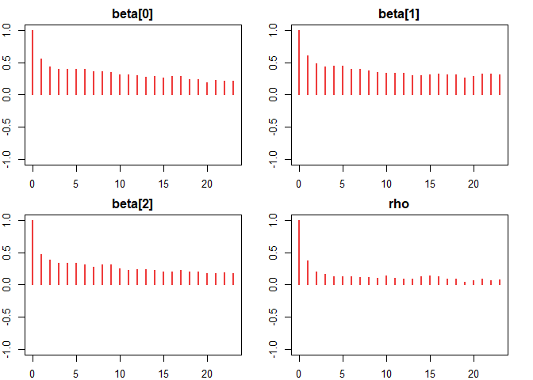
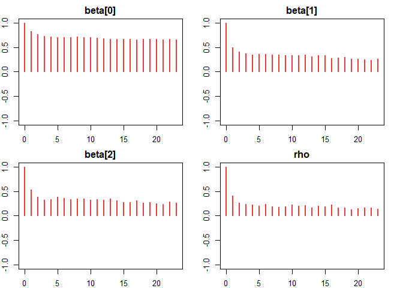
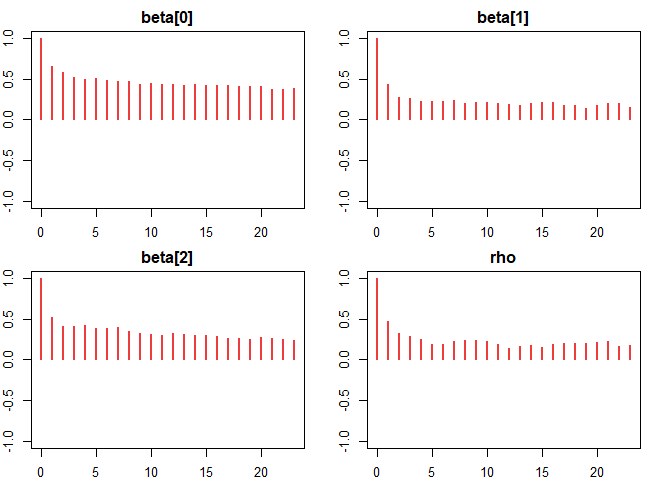
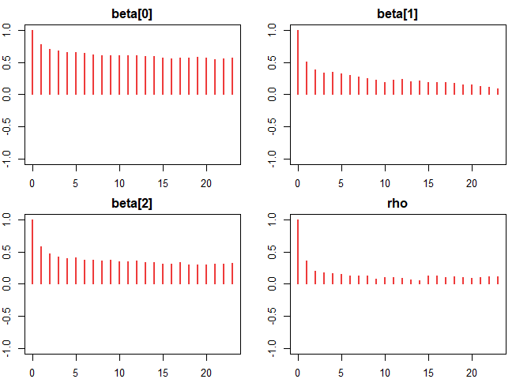
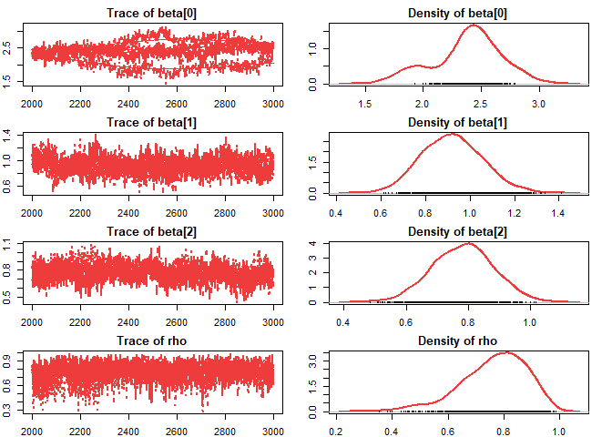

<!-- README.md is generated from README.Rmd. Please edit that file -->

# saeHB.Spatial.Beta

The `saeHB.Spatial.Beta` package provides several functions to estimate
small area proportions using the Hierarchical Bayesian (HB) method.
Model-based estimators are designed for variables of interest that
follow a Beta distribution (proportions bounded between 0 and 1). The
package supports both non-spatial and spatial models based on
Simultaneous Autoregressive (SAR) and Leroux Conditional Autoregressive
(CAR) structures for area-level random effects, with optional survey
design effect (DEFF) adjustments for sampling variances. In addition, it
provides utility functions for constructing spatial weights matrices and
performing spatial autocorrelation diagnostics. The `runjags` package is
used to obtain posterior estimates via Markov Chain Monte Carlo (MCMC)
with parallel computing capabilities.

## Author

Boby Iwan, Cucu Sumarni

## Maintainer

Boby Iwan <bobyiwanboby2122@gmail.com>

## Functions

- `betadeff_sar()` Estimates small area proportions using a Hierarchical
  Bayes (HB) method under a Spatial SAR Model with a Beta distribution,
  incorporating survey design effect (DEFF) adjustments.
- `beta_sar()` Estimates small area proportions using a Hierarchical
  Bayes (HB) method under a Spatial SAR Model with a Beta distribution
  without DEFF adjustments, by estimating the unknown precision
  parameter.
- `betadeff_lerouxcar()` Estimates small area proportions using a
  Hierarchical Bayes (HB) method under a Spatial Leroux CAR Model with a
  Beta distribution, incorporating survey design effect (DEFF)
  adjustments.
- `beta_lerouxcar()` Estimates small area proportions using a
  Hierarchical Bayes (HB) method under a Spatial Leroux CAR Model with a
  Beta distribution without DEFF adjustments, by estimating the unknown
  precision parameter.
- `betadeff_nonspatial()` Estimates small area proportions using a
  Hierarchical Bayes (HB) method under a Non-Spatial Model with a Beta
  distribution and Independent and Identically Distributed (IID) random
  effects, incorporating DEFF adjustments.
- `beta_nonspatial()` Estimates small area proportions using a
  Hierarchical Bayes (HB) method under a Non-Spatial Model with a Beta
  distribution and IID random effects without DEFF adjustments, by
  estimating the unknown precision parameter.
- `build_w()` A utility function to construct spatial weights matrices
  (contiguity, distance, or kernel) required for spatial modeling.
- `moran_test()` A diagnostic function to perform Moran’s I test for
  spatial autocorrelation.

## Installation

**System Requirement:** Since this package relies on `runjags` for
parallel MCMC computations, you must first install the [JAGS (Just
Another Gibbs Sampler)](https://mcmc-jags.sourceforge.io/) software on
your computer before installing this package.

You can install the development version of saeHB.Spatial.Beta from
[GitHub](https://github.com/BobyIwan/saeHB.Spatial.Beta) with:

``` r
# install.packages("devtools")
devtools::install_github("BobyIwan/saeHB.Spatial.Beta")
```

Or, to include the vignette, use the following command:

``` r
devtools::install_github("BobyIwan/saeHB.Spatial.Beta", build_vignettes = TRUE)
```

## Example

This is a basic example of using the `betadeff_sar()` function to make
an estimate based on synthetic data in this package:

``` r
library(saeHB.Spatial.Beta)

# Load dataset and proximity matrix
data(databeta)
data(weight_mat)

# Fitting the Spatial SAR model
model_sar_deff <- betadeff_sar(
  formula = y ~ x1 + x2,
  deff = "deff",
  n_i = "n_i",
  proxmat = weight_mat,
  data = databeta
)
```



Extract the mean estimation for the areas:

``` r
head(model_sar_deff$est)
#>        Estimate   Est.Error  l-95% CI  u-95% CI
#> mu[1] 0.7017291 0.096885564 0.4983159 0.8666782
#> mu[2] 0.7459065 0.080078825 0.5704012 0.8755842
#> mu[3] 0.8343082 0.061829998 0.6859204 0.9385485
#> mu[4] 0.9028458 0.044167418 0.7996379 0.9702999
#> mu[5] 0.9178821 0.055304048 0.7613738 0.9810034
#> mu[6] 0.9945548 0.003749456 0.9854869 0.9990520
```

Extract the estimated model coefficients:

``` r
model_sar_deff$coefficient
#>          Estimate  Est.Error  l-95% CI  u-95% CI     Rhat       ESS
#> beta[0] 2.3799473 0.29529197 1.7512250 2.9026095 2.452531  98.92171
#> beta[1] 0.9182145 0.13552309 0.6660229 1.1913135 1.046490 275.96467
#> beta[2] 0.7818077 0.09901004 0.5895655 0.9717608 1.101992 183.04518
#> rho     0.7645963 0.11777634 0.4820338 0.9486901 1.098250 575.54412
```

Extract the random effect for the areas:

``` r
model_sar_deff$randeff
#>          Estimate Est.Error   l-95% CI    u-95% CI
#> v[1]  -1.70777778 0.5615744 -2.7208200 -0.53584700
#> v[2]  -0.62348113 0.5407259 -1.5325300  0.39827100
#> v[3]  -0.74602832 0.6062077 -1.6947505  0.88533900
#> v[4]   0.79347339 0.6170433 -0.3869757  2.07338000
#> v[5]   1.29080042 0.6019364  0.1301480  2.38698000
#> v[6]   1.33612016 0.6740930  0.1457082  2.56307000
#> v[7]  -2.47138395 0.4894205 -3.3363000 -1.51118675
#> v[8]  -2.46806509 0.5235362 -3.5355900 -1.46831975
#> v[9]  -0.85671388 0.4312593 -1.7661300 -0.00823731
#> v[10] -0.04103197 0.8487672 -1.3665100  1.48544000
#> v[11]  1.96271967 0.5596277  0.9732730  3.11907000
#> v[12]  1.23240446 0.8027274  0.0376673  3.29243000
#> v[13] -1.42850757 0.5936887 -2.6070600 -0.39806500
#> v[14] -1.28551098 0.6467259 -2.5734200 -0.21280700
#> v[15] -0.89073273 0.6077328 -2.0483500  0.37112000
#> v[16]  0.47921589 0.5202272 -0.4873143  1.59570000
#> v[17]  1.59428106 0.6383524  0.5043970  2.97572850
#> v[18]  0.88056914 0.8054164 -0.6073520  2.37332000
#> v[19] -1.03484421 0.5855805 -2.1776300  0.21448500
#> v[20] -0.45863612 0.5813516 -1.7739290  0.54978500
#> v[21]  0.12756302 0.6535363 -0.9845299  1.33629000
#> v[22] -0.12787467 0.4681625 -1.1592542  0.72765200
#> v[23]  1.49304220 0.6450319  0.3711380  2.91233000
#> v[24]  0.55243058 0.7081370 -0.5994950  1.99785000
#> v[25] -0.69040380 0.6784015 -1.8384600  0.59901300
#> v[26]  0.32374148 0.6780686 -0.7870770  1.80010000
#> v[27]  0.53429165 0.8239444 -0.5974060  2.56700000
#> v[28]  0.71534918 0.7362685 -0.7451820  2.04099000
#> v[29]  0.32661605 0.7070538 -1.0471300  1.52953000
#> v[30]  0.68515098 0.5722189 -0.3556202  1.83830000
#> v[31]  0.34035027 0.8132982 -1.0117000  1.86383550
#> v[32]  0.69916252 0.6441079 -0.6041560  1.91902375
#> v[33]  0.13246887 1.0582490 -1.6042800  2.36532000
#> v[34]  0.53846984 0.6486921 -0.2961370  2.23985000
#> v[35]  2.02351080 0.4389761  1.2886105  2.93016000
#> v[36]  1.13722282 0.5378629  0.1155438  2.21357000
```

Extract the random effect variance for the areas:

``` r
model_sar_deff$refvar
#>           Estimate Est.Error  l-95% CI u-95% CI
#> a.var[1]  5.642536  117.8309 0.9090503 9.923105
#> a.var[2]  5.562181  117.9993 0.8825991 9.770156
#> a.var[3]  5.363471  118.0870 0.8346924 9.215804
#> a.var[4]  5.363471  118.0870 0.8346924 9.215804
#> a.var[5]  5.562181  117.9993 0.8825991 9.770156
#> a.var[6]  5.642536  117.8309 0.9090503 9.923105
#> a.var[7]  5.562181  117.9993 0.8825991 9.770156
#> a.var[8]  5.514998  118.2661 0.8569749 9.745009
#> a.var[9]  5.318879  118.3609 0.8128030 9.184931
#> a.var[10] 5.318879  118.3609 0.8128030 9.184931
#> a.var[11] 5.514998  118.2661 0.8569749 9.745009
#> a.var[12] 5.562181  117.9993 0.8825991 9.770156
#> a.var[13] 5.363471  118.0870 0.8346924 9.215804
#> a.var[14] 5.318879  118.3609 0.8128030 9.184931
#> a.var[15] 5.163913  118.4728 0.7729767 8.729135
#> a.var[16] 5.163913  118.4728 0.7729767 8.729135
#> a.var[17] 5.318879  118.3609 0.8128030 9.184931
#> a.var[18] 5.363471  118.0870 0.8346924 9.215804
#> a.var[19] 5.363471  118.0870 0.8346924 9.215804
#> a.var[20] 5.318879  118.3609 0.8128030 9.184931
#> a.var[21] 5.163913  118.4728 0.7729767 8.729135
#> a.var[22] 5.163913  118.4728 0.7729767 8.729135
#> a.var[23] 5.318879  118.3609 0.8128030 9.184931
#> a.var[24] 5.363471  118.0870 0.8346924 9.215804
#> a.var[25] 5.562181  117.9993 0.8825991 9.770156
#> a.var[26] 5.514998  118.2661 0.8569749 9.745009
#> a.var[27] 5.318879  118.3609 0.8128030 9.184931
#> a.var[28] 5.318879  118.3609 0.8128030 9.184931
#> a.var[29] 5.514998  118.2661 0.8569749 9.745009
#> a.var[30] 5.562181  117.9993 0.8825991 9.770156
#> a.var[31] 5.642536  117.8309 0.9090503 9.923105
#> a.var[32] 5.562181  117.9993 0.8825991 9.770156
#> a.var[33] 5.363471  118.0870 0.8346924 9.215804
#> a.var[34] 5.363471  118.0870 0.8346924 9.215804
#> a.var[35] 5.562181  117.9993 0.8825991 9.770156
#> a.var[36] 5.642536  117.8309 0.9090503 9.923105
```

## References

- Rao, J. N. K., & Molina, I. (2015). *Small Area Estimation* (2nd ed.).
  New Jersey: John Wiley & Sons, Inc. <doi:10.1002/9781118735855>.
- Liu, B., Lahiri, P., & Kalton, G. (2014). Hierarchical Bayes Modeling
  of Survey-Weighted Small Area Proportions. *Statistics Canada*.
  <https://www150.statcan.gc.ca/n1/pub/12-001-x/2014001/article/14030-eng.pdf>.
- Kubacki, J., & Jedrzejczak, A. (2016). Small Area Estimation of Income
  Under Spatial SAR Model. *Statistics in Transition New Series*,
  *17*(3), 365–390. <doi:10.59170/stattrans-2016-022>.
- Leroux, B. G., Lei, X., & Breslow, N. (2000). Estimation of Disease
  Rates in Small Areas: A New Mixed Model for Spatial Dependence.
  In M. E. Halloran & D. Berry (Eds.), *Statistical Models in
  Epidemiology, the Environment, and Clinical Trials* (Vol. 116,
  pp. 179–191). New York: Springer. <doi:10.1007/978-1-4612-1284-3_4>.
- Chung, H. C., & Datta, G. S. (2020). *Bayesian Hierarchical Spatial
  Models for Small Area Estimation* (Research Report Series).
  Washington, D.C.: U.S. Census Bureau.
  <https://www.census.gov/content/dam/Census/library/working-papers/2020/adrm/RRS2020-07.pdf>.
- Figueroa-Zúñiga, J. I., Arellano-Valle, R. B., & Ferrari, S. L. P.
  (2013). Mixed beta regression: A Bayesian perspective. *Computational
  Statistics & Data Analysis*, 61, 137-147.
  <doi:10.1016/j.csda.2012.12.002>.
- Denwood, M. J. (2016). runjags: An R Package Providing Interface
  Utilities, Model Templates, Parallel Computing Methods and Additional
  Distributions for MCMC Models in JAGS. *Journal of Statistical
  Software*, 71(9), 1–25. <doi:10.18637/jss.v071.i09>.
- Anselin, L. (1988). *Spatial Econometrics: Methods and Models*.
  Dordrecht: Springer Netherlands. <doi:10.1007/978-94-015-7799-1>.
- Anselin, L., & Morrison, S. (2019). *Spatial Weights as Distance
  Functions*.
  <https://spatialanalysis.github.io/lab_tutorials/Spatial_Weights_as_Distance_Functions.html>.
